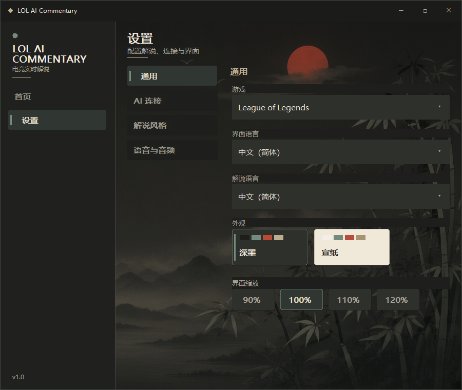
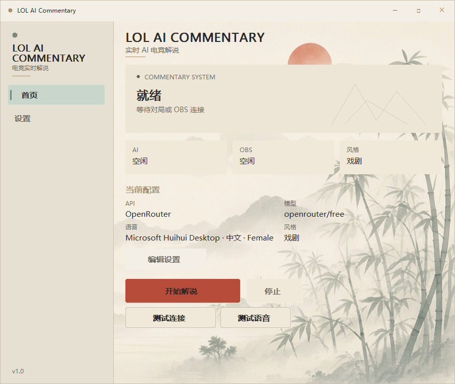
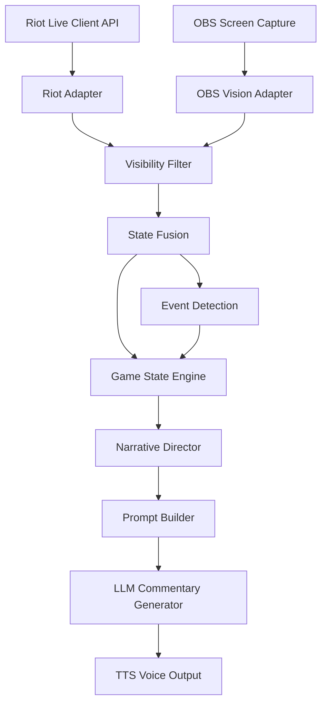

# LOL AI Commentary

> Real-time AI Esports Commentary for League of Legends

A Windows desktop system that turns a live League of Legends match into professional-sounding voice commentary. It reads the Riot Live Client API and optional OBS capture, decides *whether* to speak, then generates short esports-style lines through an LLM and plays them with TTS.

It is an **AI commentator**, not a coach and not a cheat. It only comments on legally visible information, and it stays silent when an event is not worth saying.

## Preview

<table>
  <tr>
    <td align="center" width="50%">



Dark / Ink

    </td>
    <td align="center" width="50%">



Paper / Xuan

    </td>
  </tr>
</table>

### In-Game Commentary


> Real-time AI commentary generated from live game state during a League of Legends match.

## Project Overview

**LOL AI Commentary** is a real-time esports commentary pipeline for League of Legends, with a native Win32 launcher.

Typical users:

- Ranked players who want broadcast atmosphere without being told what to do
- Streamers who want a commentary layer on top of a normal game

The product boundary is strict:

- Inputs are the Riot Live Client Data API and the player’s own OBS capture
- Fog-of-war inference, future prediction, and “you should…” coaching are out of scope
- Facts are decided in structured modules; the LLM only writes the line

## Features

- Native Windows launcher (Home, Settings, Start / Stop, connection tests)
- Dark / Ink and Paper / Xuan UI themes
- Riot Live Client adapter for structured match facts (kills, objectives, towers, player state)
- Optional OBS WebSocket capture for minimap / on-screen context
- Visibility filter and state fusion before any commentary decision
- Event detection separated from game-state interpretation
- Narrative policy: speak / stay silent, priority, emotion (calm / excited / epic)
- Commentary styles: Calm, Balanced, Dramatic, Competitive, Custom
- LLM generation through OpenAI-compatible providers (including OpenRouter)
- TTS: Windows SAPI voices and ElevenLabs
- Independent **App Volume** (this process) and **TTS Volume**
- Queueing, preemption, and drop of stale utterances so late lines do not pile up

## Architecture

Raw Riot / OBS data never goes straight to the LLM. The pipeline is:



| Layer | Role |
| --- | --- |
| Riot Adapter | Structured facts from the live client |
| OBS Vision Adapter | Visible-frame observations with confidence |
| Visibility Filter | Safety boundary: drop or downgrade illegal / hidden info |
| State Fusion | One current-match snapshot |
| Event Detection | *What happened* (kills, dragons, towers, fights) |
| Game State Engine | *Why it matters* in the current game |
| Narrative Director / Policy | *Whether / when / how intensely* to speak |
| Prompt Builder | Only LLM input: allowed facts, tone, bans |
| LLM Generator | Natural-language line only |
| TTS | Speech, queue, interrupt, expiry |

Core domain modules live in Rust and are independent of the launcher UI.

## TTS

Two engines are available in Settings → Voice:

| Engine | Notes |
| --- | --- |
| Windows SAPI | Local voices installed on the machine |
| ElevenLabs | Cloud voices; API key is entered in Settings and is **not** written to `launcher.json` |

Playback is queued. High-priority lines can preempt lower ones. Expired or duplicate text is not played. App Volume uses the current-process audio session (`ISimpleAudioVolume`); it does not change the Windows master volume. TTS Volume is a separate setting.

## Configuration

Copy `.env.example` and fill in what you use:

```
LLM_BASE_URL=
LLM_API_KEY=
LLM_MODEL=
LLM_TIMEOUT_SECS=
ELEVENLABS_API_KEY=
OBS_WEBSOCKET_URL=ws://127.0.0.1:4455
OBS_WEBSOCKET_PASSWORD=
OBS_SOURCE_NAME=LeagueCapture
```

Launcher settings (provider, model, voice, language, theme, volumes, style) are stored in `launcher.json` next to the executable. **API keys are not stored in `launcher.json`.** Enter them in Settings (or via environment variables).

OBS is optional if you only want to open the Launcher. For visual context during commentary, start OBS and configure the WebSocket source first.

## Installation

**Requirements:** Windows 10 / 11, [Rust](https://rustup.rs/) (stable), League of Legends for live matches.

```bash
cargo run
```

Official user entry. Starts the AI Commentary Launcher.

```bash
cargo run --bin mvp
```

Development / debug entry. Runs the commentary pipeline in the console without the Launcher GUI.

Release binary:

```bash
cargo build --release --bin launcher
```

The official executable is `target/release/launcher.exe`. A portable folder can ship `Launcher.exe`, `.env.example`, and a short README — no extra image assets are required at runtime.

## Usage

1. Start League of Legends (the Live Client API is only available in a match).
2. Optionally start OBS if you want minimap / on-screen context.
3. Open the Launcher, configure provider, model, API key, voice, and commentary language.
4. Click **Test Connection** and **Test Voice** if needed.
5. Return to Home and click **Start Commentary**.
6. Use **Stop** to end the session.

The Launcher can open without League running; commentary starts when live game data is available.

## Safety / Commentary Policy

The system is designed so that talking more is not a success metric. Silence is a feature.

Will do:

- Comment on confirmed, legally visible events
- Explain why a fight, objective, or tower mattered
- Stay quiet on low-value or incomplete information
- Keep lines short (about 1–2 sentences)

Will not do:

- Coaching (“you should…”, “retreat now”)
- Fog-of-war enemy location inference
- Predicting the next play as fact
- Auto-accept, auto-pick, auto-runes, or auto-chat
- Feeding raw API payloads or raw frames to the LLM

Policy details (cooldown, kill/objective priority, visual-warning gates) live in `src/commentary_policy` and the narrative engine. Prompt constraints live in `src/prompt_builder`.

## Roadmap

Shipped toward the live MVP loop: capture → filter → events → narrative → LLM → TTS, plus a Windows launcher.

Next directions from the project docs (not all are in the current binary):

- Stronger streamer mixing / OBS scene integration
- Replay and audit logs so a line can be traced back to facts
- Broader language and commentator-persona options
- Local-model / offline generation path
- Contributor guide and stricter review for anything that touches the information boundary

## License

A formal license file is not published in this repository yet. The project is intended as an open-source League of Legends commentary tool for personal and streaming use, within Riot’s and third-party API terms. Do not use it to build coaching, scouting, or fog-of-war tools.
