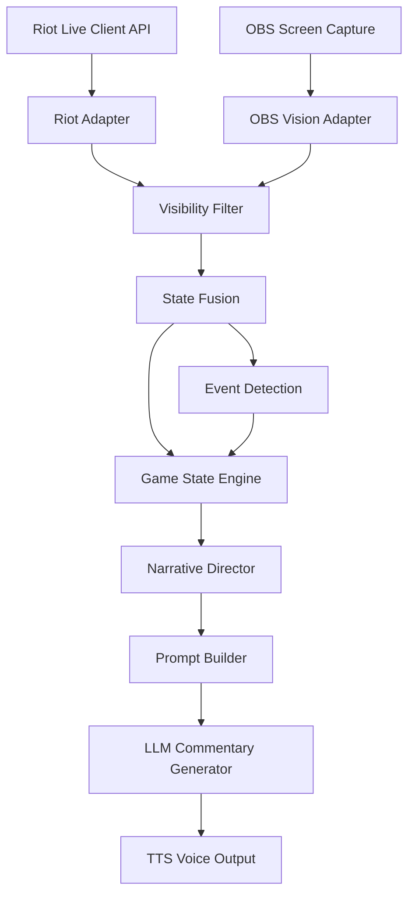

# 系统架构

## 架构目标

英雄联盟AI解说员的系统架构必须同时满足三个目标：

- 实时解析玩家当前对局。
- 只使用玩家队伍合法可见的信息。
- 生成像专业电竞解说一样有节奏、有上下文、有情绪的语音内容。

因此系统不能把 Riot API 数据和 OBS 画面直接交给 LLM。所有原始输入都必须先经过可见性过滤、状态融合、事件检测、游戏状态解释和叙事决策。LLM 只负责把结构化提示词转化为自然语言解说。

## 高层数据流

## 输入层

### Riot Adapter

Riot Adapter 负责读取 Riot 实时客户端 API，获取结构化事实数据，例如游戏时间、英雄、等级、生命值、法力值、装备、击杀事件、目标状态和队伍信息。

该模块只负责采集和标准化，不解释事件意义，也不决定解说内容。

### OBS Vision Adapter

OBS Vision Adapter 负责处理玩家本人游戏画面，补充 API 不提供或不够细的信息，例如英雄移动、技能动画、小地图动向、镜头位置、视觉特效和玩家视角。

该模块只能处理画面中实际可见的信息。它不能根据不可见区域推断敌人位置，也不能把视觉识别结果当作确定事实直接传给 LLM。

## 合法信息治理层

### Visibility Filter

Visibility Filter 是系统的安全边界。它负责丢弃、降级或标记任何不应进入解说链路的信息。

它需要保证：

- 输入只来自 Riot 实时客户端 API 和玩家自己的 OBS 画面。
- 小地图判断只基于玩家画面中实际显示的内容。
- 不保留隐藏敌人位置、不可见行为或未经确认的预测。
- 不允许后续模块绕过可见性过滤直接访问原始输入。

### State Fusion

State Fusion 负责将 API 结构化数据和 OBS 可见信息合并成统一的当前比赛快照。

它输出的是“可解说事实状态”，而不是自然语言。状态融合需要保留置信度、时间戳和来源信息，以便后续模块判断事件是否可靠。

## 事实事件层

### Event Detection

Event Detection 只回答一个问题：发生了什么。

它负责从连续状态中识别事实事件，例如：

- 某方完成击杀。
- 小龙、峡谷先锋、男爵或防御塔被拿下。
- 某一路爆发团战或一打一。
- 团战结束并形成几换几结果。
- 玩家镜头正在关注某个战斗区域。

Event Detection 不解释事件是否重要，不决定是否发言，也不生成自然语言。

## 游戏状态解释层

### Game State Engine

Game State Engine 负责解释事件含义。它接收当前可见状态和事件结果，判断这些事件在比赛背景中的价值。

它回答的问题是：

- 当前处于前期、中期还是后期。
- 哪些资源即将或已经成为关键争夺点。
- 某次击杀是否影响小龙、男爵、推进或结束比赛。
- 某次团战结果对经济、地图资源或节奏有什么影响。
- 事件是否只是普通波动，还是值得高优先级解说。

Game State Engine 不生成自然语言，也不直接调用 LLM。它输出结构化状态解释，例如事件重要性、上下文摘要、风险标记和可讲述角度。

## 叙事决策层

### Narrative Director

Narrative Director 是游戏状态与 LLM 之间的叙事控制组件。它负责决定 AI 是否应该发言，以及发言的优先级、情绪强度和解说风格。

它回答的问题是：

- 这件事是否值得说。
- 是否应该现在说，还是等待更完整的结果。
- 当前是否应该保持沉默。
- 解说语气应是平静、紧张、兴奋还是高潮。
- 是否存在多个事件竞争发言，需要选择优先级。

Narrative Director 是防止 AI 变成日志播报器的核心模块。

### Prompt Builder

Prompt Builder 负责把 Narrative Director 的决策和 Game State Engine 的结构化解释转换成 LLM 可消费的结构化提示词。

LLM 不应接收原始游戏状态、原始 API 响应或原始视觉识别结果。它只接收经过治理的提示词包，包括：

- 当前解说目标。
- 可引用事实。
- 事件背景。
- 情绪强度。
- 风格约束。
- 禁止输出规则。
- 语言和长度要求。

## 生成与输出层

### LLM Commentary Generator

LLM Commentary Generator 只负责生成自然语言解说。它不能自行读取游戏状态，也不能自行判断隐藏信息或未来事件。

它的输出必须符合以下约束：

- 只评论已发生或已确认的信息。
- 不提供操作建议。
- 不预测敌方隐藏位置。
- 不生成“你应该”类指导话术。
- 不把低置信视觉信息说成确定事实。

### TTS Voice Output

TTS Voice Output 负责将解说文本转为语音，并控制播放时机。

该模块需要支持打断、排队、丢弃过期解说和控制语音长度。实时解说中，迟到的正确解说仍然可能是坏体验，因此 TTS 层必须尊重 Narrative Director 的优先级和过期策略。

## MVP 范围

MVP 应聚焦于最小闭环：

- Riot API 采集。
- OBS 玩家画面采集。
- 可见性过滤。
- 状态融合。
- 基础事件检测。
- 基础 Game State Engine。
- Narrative Director 初版。
- Prompt Builder 初版。
- LLM 语音解说。
- TTS 输出。

回放系统和审计日志系统非常重要，但不属于 MVP。它们应在核心实时链路验证后进入后续阶段。

## 架构原则

- 原始数据不能直接进入 LLM。
- Event Detection 与 Game State Engine 必须分离。
- Game State Engine 解释含义，但不生成语言。
- Narrative Director 决定是否说、何时说、说多激动。
- Prompt Builder 是 LLM 的唯一输入构建入口。
- LLM 是表达层，不是事实层或决策层。
- 信息边界优先于解说效果。
